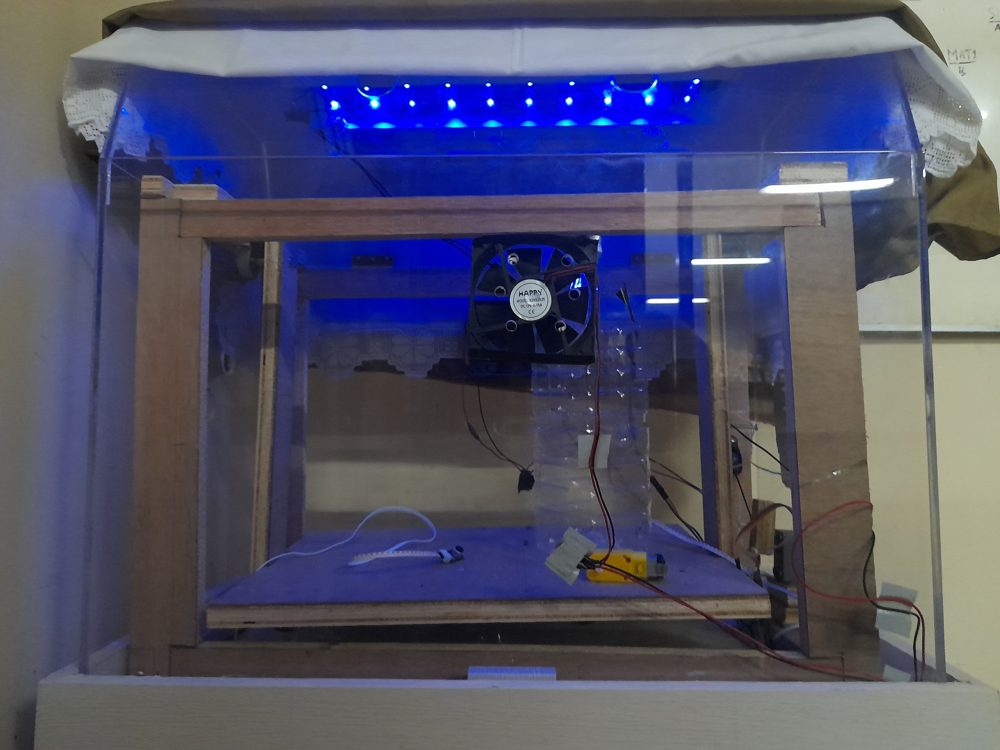

# Incubator Light Control Using Fuzzy Sugeno

System for controlling newborn Incubator light intensity. The purpose of the system is to make the newborn have stable intensity of light in purpose to maintain his body temperature. System using

 - BH1750, Digital Light Sensor
 - High Power LED (HPL) with Driver L298N

BH1750 is take the intensity of light inside the incubator and using error and delta error of the setpoint the system can calculate the optimal light for the system to be stable.

